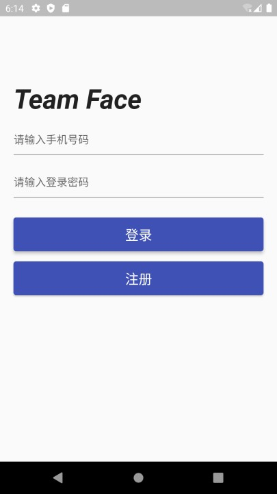
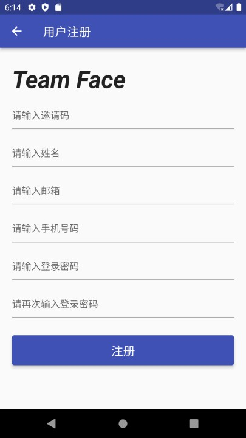
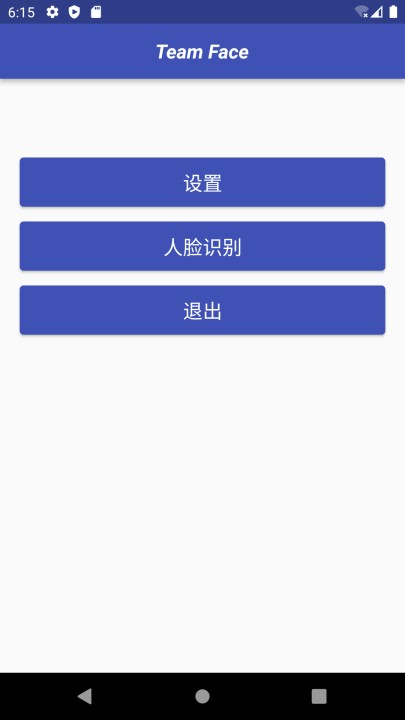
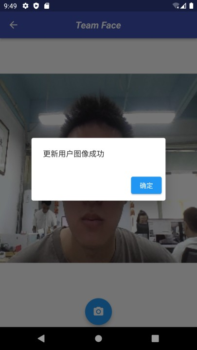
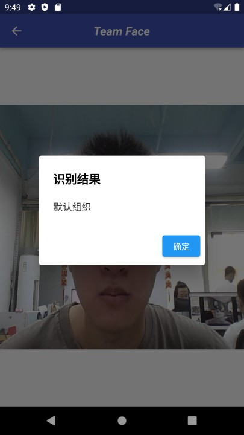
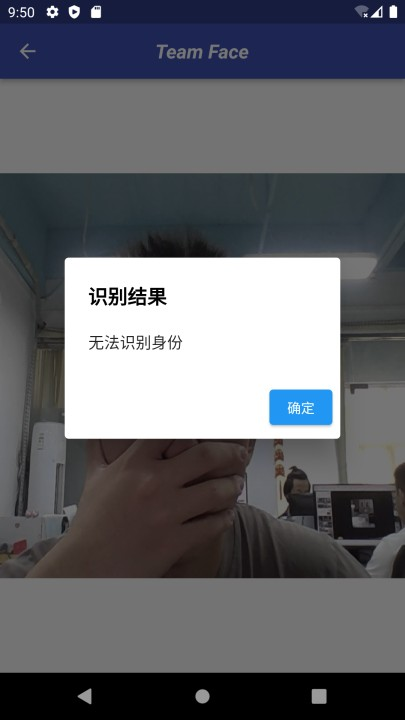

# Team Face

## Introduction
TeamFace, an android app, applied the face recognition deep learning algorithm to recognize the entered face and authenticate the user’s identity of the organization. Our app can be widely used in various personnel management application scenarios.

## Usage
* Administrator system & Android APK installation package: click [here](http://39.103.167.15:2022).
* Use the organization code 000 to register as a user of the Test Group.
* Click ‘设置’ and follow the instructions to set up the user images.
* Click ‘人脸识别’ to recognize your face and authenticate your identity.

## Functions
* The users can only successfully register and bind to the corresponding organization by the organization code.
* Successfully registered users can log in and out of the app.
* Users can collect and set their faces in the app to authenticate their identities.
* The bound organization will be displayed if the face recognition is successful.
* The administrator can manage user data in the administrator system, such as modifying user information, adding organizations, setting registration codes, etc.

## Demo

   
  

